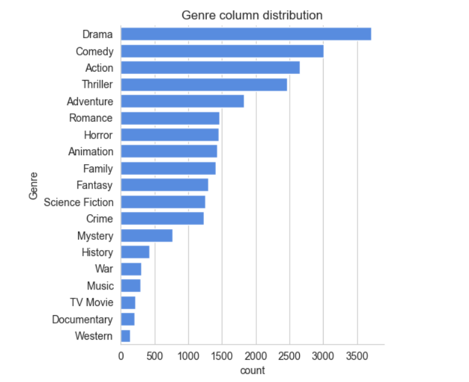
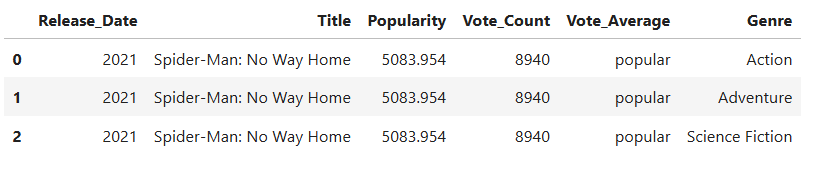
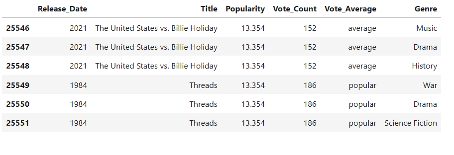

# Project Description
This project analyzes a dataset of 10,000 Netflix movies to uncover insights about content trends, genres, ratings, and release patterns. Using Python, it performs data preprocessing and exploratory data analysis (EDA), helping understand Netflix’s movie library and viewer preferences.

# Features
* Data cleaning and preprocessing
* Handling missing values and duplicates
* Exploratory Data Analysis (EDA) on Netflix movies
* Visualizations of trends, popular genres, and ratings
* Insights into movie release patterns over the years

# Tech Stack
* Python – programming language
* Pandas, NumPy – data manipulation
* Matplotlib, Seaborn – visualizations
* Jupyter Notebook – analysis environment

# Screenshots
## Count of movies of different genres

## Movie with highest popularity

## Movie with least popularity

## Number of movies released in each year

## Votes distribution

# Dataset
* Source: Kaggle – Netflix Movies Dataset
* Size: ~10,000 records
* Type: Movies metadata

# How to Run
* Download or clone the repository.
* Open netflix_movie_data_analysis.ipynb in Jupyter Notebook or Google Colab.
* Run all cells to perform the analysis and generate visualizations.

# Files
* netflix_movie_data_analysis.ipynb – main notebook
* mymoviedb.csv – dataset used for analysis
